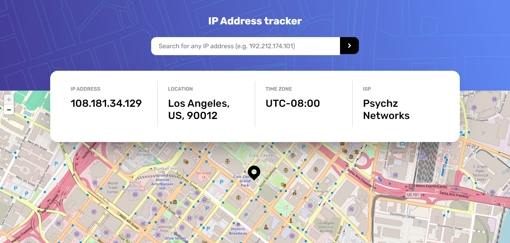

## DEVELOPER NOTES
**NOTE**: In this project it would be assumed that different formats could be used for tracking like IPv4, IPv6 and Domain, the API I used for this challenge doesn't allow IPv6 and Domain format because I'm using a free plan, so currently it only works with IPv4 format.
-----
Hello everyone, there is a new challenge where I worked with leaflet, marker and geolocation
this is the second time I work with that kind of information, it was very funny and exciting to work with it again.

**Status**: 
-General testing

## PROJECT
**Technolgies**: HTML, CSS, Javascript, HTML, ReactJS using Context and Provider, Vite, [leafletJS](https://leafletjs.com/), [geolocation API](https://ipgeolocation.io/documentation/ip-geolocation-api.html).

[Live Demo](https://65b33bad3880fd7a9d87df9b--euphonious-valkyrie-1818c7.netlify.app/) | [FrontMentor Challenge](https://www.frontendmentor.io/challenges/ip-address-tracker-I8-0yYAH0) | [ipgeolocation API](https://ipgeolocation.io/documentation.html)

